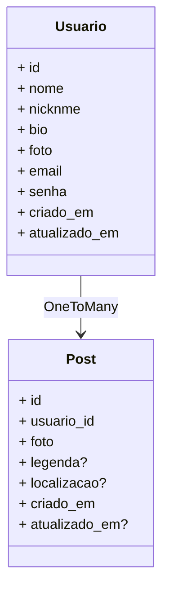

# API do Instagram

## Tecnologias

-  NodeJS
-  ExpressJS
-  MySQL
-

### Recursos

-  Usuarios
-  Posts
-  Comentarios
-  Curtidas

### Estrutura dos Dados

```mermaid
classDiagram
    Usuario --> Post: OneToMany

    class Usuario {
        + id
        + nome
        + nicknme
        + bio
        + foto
        + email
        + senha
        + criado_em
        + atualizado_em
    }

    class Post {
        + id
        + usuario_id
        + foto
        + legenda?
        + localizacao?
        + criado_em
        + atualizado_em?
    }
```
